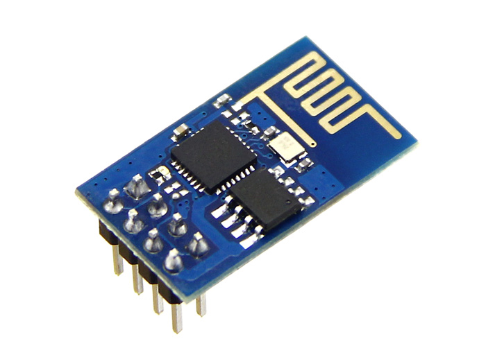

# ARDUINO - ATTINY - WIRELESS - IOT

miguel.granadino@gmail.com

Table of contents
=================

* [IoT with Arduino and RPi](#iot-with-arduino-and-rpi)
* [Wifi module ESP8266](#wifi-module-esp8266)
* [NRF24l01](#nrf24l01)
* [Modulos 433MHz](#rf-433-mhz-modulos-transmisor-y-receptor)
* [Funduino mini pro](#funduino-mini-pro-atmega328p)
* [ATtiny85](#attiny85)
* [Transmision de video en tiempo real](#transmision-de-video-en-tiempo-real)

IoT with Arduino and RPi
----------------------------

### Raspberry (gateway) and Arduino (node sensor)

Ejemplo de arquitectua hardware:


[Fuente - parte 1](http://thenewstack.io/tutorial-prototyping-a-sensor-node-and-iot-gateway-with-arduino-and-raspberry-pi-part-1/)

[Fuente - parte 2](http://thenewstack.io/tutorial-configuring-a-sensor-node-and-iot-gateway-to-collect-and-visualize-data-part-2/)


Wifi module ESP8266
--------------------

Sirven para añadir WIFI al microcontrolador

- Se alimenta a 3.3v
- Alimentarlo con una fuente externa al Arduino, tiene picos de 200ma (al arrancar).
- Es un SoC: microcontrolador más wifi.





[Comparando Arduino y el ESP8266](http://polaridad.es/compara-arduino-esp8266/)


NRF24l01
-----------

[Tutorial](http://www.prometec.net/nrf2401/)

Dispositivos de radio basados en el chip de Nordic semiconductor  NRF24.

Estos modulos son TRANCEPTORES, es decir mediante programacion los podemos poner como emisores o como receptores o configurarlos para que hagan ambas cosas. Puede llegar a transmitir datos a 2Mbps , en distancias menores a 40 metros al aire libre y a 1Mbps a 8 metros de distancia.

- Operan en la banda de 2.4Ghz, que es de libre uso a nivel mundial (no tenemos garantía de que no haya alguien más emitiendo en esta banda en las cercanías, lo que puede producir interferencias)
- Velocidad configurable de 250kb, 1 Mb o 2Mb por segundo.
- Muy bajo consumo en Stand By (Cuando no se usan
- Podemos encontrar modelos con antenas más eficaces que aumentan el alcance hasta casi un km.
- Estos módulos usan el bus SPI.

[Arduino driver for nRF24L01](https://github.com/maniacbug/RF24)


| PIN   |  Arduino uno      |
|----------|:-------------:|
| MOSI | 11 |
| MISO | 12 |
| SCK | 13 |
| CS | 10 |
| CE | 9 |

### Soluciones a posibles problemas

- Es muy conveniente conectar un capacitor de 10NanoFaradios entre VCC y GND, para eliminar el ruido
Alimentacion a 3.3V o 5V.
- La manera más sencilla de evitar problemas ha sido asegurarme de que el emisor tiene una alimentación correcta y abundante, mediante un alimentador externo (al arduino).


RF 433 MHz modulos transmisor y receptor
-------------------------------------------
Comunicación unidireccional entre dos arduinos pro mini (funduino)


Problema: alcance muy corto 1.5m - 2m, posibilidades de perdida de datos alta.

A favor: bajo coste --> 1.5€ ambos módulos


Funduino pro mini ATMEGA328P
----------------------------

Alimentación: 3.3V o 5V


ATtiny85
--------------


### Programar el ATtiny

Los microcontroladores AVR permiten la programación "in circuit". (ISP). No es necesario extraer el microcontrolador
de la placa de circuito impreso para reprogramarlo.


- binutils-avr --> herramientas como el ensamblador, enlazador, etc.
- gcc-avr --> compilador C GNU (compatible con ANSI C)
- avr-libc --> librería AVR C
- gdb-avr --> debugger
- avr-dude --> programador
- AVRStudio --> descarga gratis desde www.atmel.com (solo Windows)

```bash
$ apt-get install avrdude binutils-avr gcc-avr avr-libc gdb-avr

# Compilar 
$ avr-gcc -g -Os -mmcu=attiny88 -c hola_mundo_attiny85.c
$ avr-gcc -g -mmcu=attiny88 -o hola_mundo_attiny85.out hola_mundo_atttiny85.o

# Crear el hex. 
$ avr-objcopy -j .text -O ihex hola_mundo_atttiny85.out hola_mundo_attiny85.hex

# cargar el .hex en el attiny usando un programador.
```
Programa básico
```c
#include<avr/io.h>

int main(void)
{
        for(;;)
        {

        }
}

```
Programador ISP


Pinout


1. MISO
2. Vcc
3. SCK
4. MOSI
5. Reset
6. Ground


### Programar el ATtiny con arduino

[Programar el ATtiny con Arduino](http://aerobotclubderobticadeaeronuticos.blogspot.com.es/2011/06/micros-pequenos-para-proyectos-pequenos.html)

[Programming an ATtiny with arduino](http://highlowtech.org/?p=1229)

Utilizamos el arduino como programador ISP
- Descárgate y copia la carpeta (attiny45_85.zip) en la carpeta Hardware en la carpeta del Arduino. (...\arduino-0022\hardware\attiny45_85)
- Cierra el programa y vuelve abrirlo. Comprobaras que ahora en Tools/Board, te han aparecido muchas más opciones que antes.
- Monta el circuito de la figura:


- Conecta tu tarjeta de Arduino al ordenador: selecciónala en Board y el Puerto Serie que le corresponde.
- En la sección de “Ejemplos” de Arduino abre, compila y descarga a tu tarjeta el ejemplo de ArduinoISP (le estamos diciendo al Arduino que funcione como granador).
- Seleccionaremos en Tools/Board/ ATtinny85 (w/Arduino as ISP).
- Darle al botón de descargar programa.
- El ATTiny ya esta programado y listo para ser usado.

### Pinout ATtiny44_85

[Tutorial ATtiny 85](http://www.raspberrypi-es.com/category/attiny85/)


### Transmision de video en tiempo real

Fuente: transmisión de video desde drones.

**1. Elementos del sistema**
- Camara o micro-camara --> resolución, angulo de visión, a 12v o 5v(las micro), proteger la electrónica
- Transmisor de video
- Receptor de video
- Receptor de radiocontrol
- Monitor, LCD, TFT ...

En una camara CCD, la lente recoge la luz y la enfoca hacia un sensor de imagen (CCD  ó CMOS) que convierte la luz en pulsos eléctricos para más tarde  procesarlos mediante circuitos electrónicos y poder crear así la señal de video.

Los códecs MPEG (Moving Picture Experts Group ), el MPEG-2, sucesor del MPEG-1 que permite transmitir a velocidades entre  4 y 9 kbps y es capaz de soportar televisión en alta definición (HDTV).


**2. Frecuencia**

Frecuencias usadas para FPV (transmisión de video): 900Mhz (la más baja), 1.3Ghz, 2.4Ghz (microondas) y 5.8Ghz (la más alta, microondas)

Particularidades

- Cuanto mas baja la frecuencia mayor alcance. 
- Cuanto mas alta menor alcance. (con la misma potencia de emisión)
- Cuanto mas baja la frecuencia mayor penetración en obstáculos. 
- Cuanto mas alta mas problemas tiene para penetrar los obstáculos.
- Cuanto mas baja la frecuencia antenas mas grandes.
- Cuanto mas alta antenas mas pequeñas.
- Cuanto más baja la frecuencia, menor ancho de banda y por lo tanto menor calidad de imagen. 
- Cuando más alta, más ancho de banda y mayor calidad de imagen.
- Lo ideal es la frecuencia más baja posible dentro de la gama ya que cuanta menos frecuencia mayor es la longitud de onda y por tanto mejor es la penetrabilidad de una onda en los distintos obstáculos.
- Cualquier persona que tenga un receptor de la misma frecuencia y canal y si se encuentra dentro del radio de cobertura del transmisor podra ver nuestra señal de video.
- Cada frecuencia tiene una serie de canales que los fabricantes han fijado. Por ejemplo, en 5.8Ghz hay transmisores de 32 canales. Esto nos permite correr más gente a la vez en el mismo rango de frecuencia pero en distintos canales sin que se solape la señal de vídeo.
- Es tipico usar la emisora de radio a 2.4 GHz y la transmisión de video a 5.8 GHz.
- Un ejemplo de canales: para 2.4 GHz dispone, por ejemplo, de 4 canales diferentes. Estos son; Canal 1: 2.412 Mhz. Canal 2: 2452 MHz. Canal 3: 2.472 MHz. Canal 4: 2.432 MHz

**3. Potencia de la señal(mW)**

- A mayor potencia de emisión más lejos llegaremos.
- A más potencia de emisión más grandes son los transmisores, más consumen y más se calientan.
- Cuidado con la legalidad --> no se si debe ser de 25 mw máximo.
- Mientras más baja sea la frecuencia menos mw necesitas para conseguir la misma distancia.

**4. Legalidad de las frecuencias (España)**

- La emison de video al exterior no es legal en España.
- 900 MHz --> la más obvia para FPV pero se asigno para la red 3G de teléfonos móviles -->  no es legal
- 1.2 GHz --> buena penetración frente a los obstáculos --> no es legal (reservada para otros usos).
- 1.3 GHz --> esta banda es muy parecida a la anterior --> para transmisión aérea --> no es legal. 
- 2.4 GHz --> muy apropiada para señales de radio. Los equipos de video con transmisión a 2.4 GHz son muy populares entre las frecuencias FPV y es probablemente la elección más barata. 
Sin embargo la habilidad de penetración no es tan buena si la comparamos con las bandas de frecuencia anteriores. También esta banda es la más usada para muchos otros equipos como WiFi, Bluetooth, transmisores y receptores RC y es probable que haya demasiadas interferencias. Por lo tanto, si decides usar esta banda para FPV necesitarás usar otra distinta para tu transmisor RC y para la telemetría (si la estás usando).
- 5.8 GHz --> las antenas circulares polarizadas pueden ser muy pequeñas gracias a la elevada frecuencia. Buena banda para el FPV. Aunque tiene una potencia de radio bastante decente, debido a su alta frecuencia no tiene un buen poder de penetración. Por lo tanto estos vuelos suelen están limitados a donde alcance la vista principalmente. normalmente usado entre 500m y 1km.

**5. Legalidad de la potencia (España)**

- 2.4 GHz --> 10 mW.
- 5.8 GHz --> 25 mW.  


**6. Productos comerciales para sistemas FPV**

  [Fuente](http://www.dronesbaratoscaseros.com/) 
  
  [Video](https://www.youtube.com/watch?v=kKph_ks6C2M)

 - Transmisor (400mW) --> Boscam FPV 5.8G 400mW AV Transmitter Module TS353
 - Transmisor (200mW) --> TS351 (FPV 5,8 GHz 200mw) --> 12€
 - Transmisor (600mW) --> Eachine TX600 FPV 5.8GHz 600mW 32CH AV Transmitter Mushroom Antenna --> 32€
 - Receptor --> RC832 Boscam FPV 5.8GHz 32CH Wireless AV Receiver --> 19€
 - Receptor --> FR632 (FPV 5.8 GHz 32 canales)  --> 70€-80€
 - Receptor --> RC305 (FPV 5.8 GHz 8 canales 200mW) --> 15€
 - Camara --> DAL 700TVL FPV HD 1/4' CMOS (12V) --> 8€
 - Camara --> Eachine 700TVL 2.8mm CMOS (5-12V) --> 12€
 - Camara --> Tarot 12V 600TVL 120° 2.8mm FPV Camera TL300M PAL --> 16€
 - Antenas --> 5.8G Gain Petals Clover Mushrooms Antenna Set For FPV System --> 7€
 

 - Monitor TFT (5 pulgadas, 800x480) --> Blue Sky 5 Inch HD Digital Panel Display 800x480 Snowflakes Screen --> 29€
 - Monitor TFT (7 pulgadas, 800 x 480) --> 35€
 - Monitores para FPV --> http://www.banggood.com/search/fpv-monitor.html?p=722409786759201409UR
 - Bateria recargable (2200 ma) --> ZOP Power 11.1V 2200MAH 8C Lipo Battery For Devo JR WFLY Transmitter --> 11€
 - Bateria recargable (1300 ma) --> Ace High Quality 11.1v 1300mah 25c lipo battery --> 20€
 - Grabador de viceo --> 1CH Mini DVR C-DVR Motion Detection Video Radio Recorder --> 28€
 - Camara + transmisor --> Eachine 700TVL 1/3 Cmos FPV 148 Degree Camera w/32CH Transmission --> 25€
 - Camara +`transmisor --> Eachine 700TVL 1/3 Cmos FPV 110 Degree Camera w/32CH Transmission --> 20€
 - Transmisor + receptor --> Boscam FPV 5.8G 400mW AV Receiver RC805 with Transmitter TS353 --> 55€
 - Cargador de baterias LIPO --> Imax b6-ac cargador del balance de la batería de NiMH 3s lipo B6AC rc --> 32€
 - Cargador de baterias LIPO --> SKYRC E3 2S 3S LiPo AKKU Battery Balance Charger AC 110V-240V --> 10€
 - Separadores de nailon --> M3 Nylon Hex Spacers Screw Nut Assortment Kit Accessories Set --> 6€


