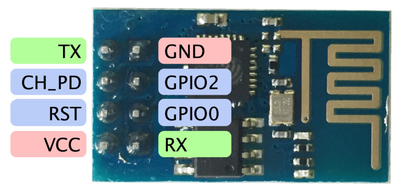
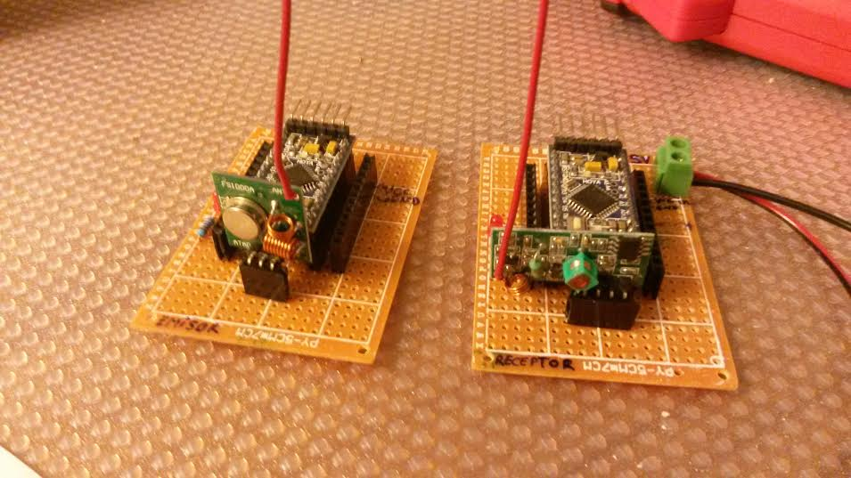

# ARDUINO - ATTINY - WIRELESS - IOT - RF

miguel.granadino@gmail.com


## Table of contents

* [IoT con Arduino y RPi](#iot-con-arduino-y-rpi)
* [ThingSpeak](#thingspeak)
* [MQTT](#mqtt)
* [ESP8266](#esp8266)
* [NodeMCU](#nodemcu)
* [NRF24l01](#nrf24l01)
* [Modulos 433MHz](#rf-433-mhz-modulos-transmisor-y-receptor)
* [Arduino mini pro](#arduino-mini-pro)
* [Arduino nano v3.x](#arduino-pro-nano)
* [Arduino MKR1000](#arduino-mkr1000)
* [LiPo](#lipo)
* [ATtiny85](#attiny85)
* [Transmision de video en tiempo real](#transmision-de-video-en-tiempo-real)

## IoT con Arduino y RPi


Raspberry (gateway) and Arduino (node sensor)

Ejemplo de arquitectua hardware:


[Fuente - parte 1](http://thenewstack.io/tutorial-prototyping-a-sensor-node-and-iot-gateway-with-arduino-and-raspberry-pi-part-1/)

[Fuente - parte 2](http://thenewstack.io/tutorial-configuring-a-sensor-node-and-iot-gateway-to-collect-and-visualize-data-part-2/)


## ThingSpeak


- Recolección de datos en tiempo real (data collection and storage)
- Analisis y visualización de datos
- ...


Uso:

- Hacerse una cuenta (gratis)
- Crear un canal (channel)
- Ir a API Keys y obtener tu llave (key)
- Pruebalo --> http://api.thingspeak.com/channels/[CHANNEL_ID]/feed.json?key=[THINGSPEAK_KEY]


## MQTT


MQTT --> MQ Telemetry Transport --> es un protocolo de comunicaciones ligero y rápido diseñado para Internet of Things. Su propósito es ser un protocolo de mensajes de publicación/subscripción basado en un broker ligero, diseñado para ser abierto, simple, ligero y fácil de implementar”. 

La arquitectura de MQTT sigue una topología de estrella, con un nodo central que hace de servidor o “broker” con una capacidad de hasta 10000 clientes. El broker es el encargado de gestionar la red y de transmitir los mensajes, para mantener activo el canal, los clientes mandan periódicamente un paquete (PINGREQ) y esperan la respuesta del broker (PINGRESP). 

Es un protocolo basado en el broker: Los clientes se conectan a un broker que media la comunicación entre ellos. Cuando otro cliente publica un mensaje sobre ese tópico, el broker le envía el mensaje a los clientes que se suscriben.

La comunicación se basa en unos “topics” (temas), que el cliente que publica el mensaje crea y los nodos que deseen recibirlo deben subscribirse a él. La comunicación puede ser de uno a uno, o de uno a muchos.

Arduino y MQTT --> 

Mosquitto -->

mosquitto -v


Mosquitto


## ESP8266


Sirven para añadir WIFI al microcontrolador

- Se alimenta a 3.3v
- Alimentarlo con una fuente externa al Arduino, tiene picos de 200ma (al arrancar).
- Es un SoC: microcontrolador más wifi. 
- Configuracion mediante comandos AT
- No necesita Arduino el ya de por si es un micontrolador (con wifi)





[Comparando Arduino y el ESP8266](http://polaridad.es/compara-arduino-esp8266/)

## NodeMCU


http://nodemcu.com/index_en.html

- NodeMCU no es más que un ESP8266-12(12 GPIOS) con conversor USB-TTL y conversor de 5v a 3.3v en una misma placa.
- Es como Arduino. Plataforma OpenHardware basada en una placa con un microcontrolador de 32 bits. Este MCU es el que ejecuta el firmware.


- Wifi SoC
- NodeMCU = ESP8266 (ESP-12) + USB to Serial + NodeMCU firmware
- Chip principal: ESP8266 (ESP 12)
- Chip serie de USB a TTL integrado en la placa
- Antena: integrada en la placa
- Frecuencia: 2.4GH, TCP/IP
- Alimentación: 3.3V
- Protocolos soportados: 802.11 b/g/n, wifi integrado. 
- Wifi Direct (P2P) Soft-AP
- Soporta WPA y WPA2 (WiFi Protected Access), encriptación.
- Interfaces: I2C/SPI, UART
- Dos versiones: v0.9(VIEJO) y v1.0(nuevo)
- Read more: http://www.cnx-software.com/2015/10/29/getting-started-with-nodemcu-board-powered-by-esp8266-wisoc/#ixzz47Ic3W2ow
- ESP8266-12: 11 digital I/O pins and 1 Analogue input.
- 30 metros de alcance
- Viene con un firmware (programa) preinstalado que puedes actualizar(Flashing)
- Dos pulsadores: reset y flash
- Puede hacer de servidor
- Se puede usar con arduino o como sistema independiente, programable independientemente
- Microcontrolador 32bits a 80MHz
- Llega a consumir 200mA y picos de hasta 400mA (mucho), no alimentar con Arduino
- Hay varias versiones del firmware, se usa la herramienta
- Cuanto funcina intensamente el MCU se calienta (hay gente que le pone un disipador)
- Programable en Lua usando el IDE Esplorer o el programa luatool
- Programable con el IDE de Arduino instalando previamente el soporte a las placas ESP8266


- Seleccionaremos el rooter al que nos conectaremos
- Este rooter nos dara una ip

### Versiones

- Hay dos versiones v0.9(viejo) y v1.0(nuevo)
- NodeMCU v0.9 with ESP-12 module --> NodeMCU = ESP8266 (ESP-12) + USB to Serial + NodeMCU firmware 
- NodeMCU v1.0 with ESP-12E module --> NodeMCU = ESP8266 (ESP-12E) + USB to Serial + NodeMCU firmware

Versión 0.9


Versión 1.0


Funcionamiento --> comandos AT

### Programación

*Usando el Arduino IDE*

Instalar el soporte para poder programar la placa nodeMCU usando el Arduino IDE

Archivo > Preferencias > En el campo "Gestor de URLs Adicionales de Tarjetas" añadir: http://arduino.esp8266.com/stable/package_esp8266com_index.json

Herramienta > Placa ... > Gestor de Tarjetas (al acceder se instalara automáticamente)

Programa que enciende un led (test nodeMCU):

```c
int led = D1;

void setup() {
  pinMode(led, OUTPUT);
  }

void loop() {
  digitalWrite(led, HIGH); 
  delay(500);
  digitalWrite(led, LOW);
  delay(500);
  }
  ```


## NRF24l01


[Tutorial](http://www.prometec.net/nrf2401/)


Módulos TRANCEPTORES --> mediante programacion los podemos poner como emisores o como receptores o configurarlos para que hagan ambas cosas.

- Chip principal: NRF24
- Frecuencia: 2.4Ghz
- Velocidad: 250kb, 1 Mb o 2Mb por segundo (confiurable)
- Consumo: 115mA y muy bajo consumo en Stand By (Cuando no se usan).
- Alcance: 1000m en abierto
- Interfaz: SPI.
- Hay versión con amplificador de potencia y antena SMA

[Arduino driver for nRF24L01](https://github.com/maniacbug/RF24)


| PIN   |  Arduino uno      |
|----------|:-------------:|
| MOSI | 11 |
| MISO | 12 |
| SCK | 13 |
| CS | 10 |
| CE | 9 |

**Soluciones a posibles problemas**

- Es muy conveniente conectar un capacitor de 10NanoFaradios entre VCC y GND, para eliminar el ruido
Alimentacion a 3.3V o 5V.
- La manera más sencilla de evitar problemas ha sido asegurarme de que el emisor tiene una alimentación correcta y abundante, mediante un alimentador externo (al arduino).

## RF 433 MHz modulos transmisor y receptor

Comunicación unidireccional entre dos arduinos pro mini (funduino)



Problema: alcance muy corto 1.5m - 2m, posibilidades de perdida de datos alta.

A favor: bajo coste --> 1.5€ ambos módulos


## Arduino pro mini


Alimentación: 3.3V o 5V

## Arduino pro nano

Funduino Pro Nano 3.x

Drivers para los Nano que llevan el chip CH340:  
http://www.wch.cn/download/CH341SER_ZIP.html

Cargar el driver:
```bash
unzip CH341SER_LINUX.ZIP
make
sudo make load # cargar el driver en el kernel de Linux
```


- Bajo coste: 2€ en Ebay
- Microcontroller:	Atmel ATmega168 or ATmega328
- Operating Voltage (logic level):	5 V
- Input Voltage (recommended):	7-12 V
- Input Voltage (limits):	6-20 V
- Digital I/O Pins:	14 (of which 6 provide PWM output)
- Analog Input: Pins	8
- DC Current per I/O Pin:	40 mA

Alimentación

- The Arduino Nano can be powered via the Mini-B USB connection
- 6-20V unregulated external power supply (pin 30)
- 5V regulated external power supply (pin 27). 
The power source is automatically selected to the highest voltage source.

Entradas y salidas

- Cada pin puede dar o recibir un maximo de 40mA
- Internal pull-up resistor (disconnected by default) of 20-50 kOhms
- PWM: 3, 5, 6, 9, 10, and 11
- SPI: 10 (SS), 11 (MOSI), 12 (MISO), 13 (SCK)
- LED: 13. There is a built-in LED connected to digital pin 13. When the pin is HIGH value, the LED is on, when the pin is LOW, it's off.
- I2C: A4 (SDA) and A5 (SCL)


## Arduino MKR1000

https://www.arduino.cc/en/Main/ArduinoMKR1000


- Microcontroller	SAMD21 Cortex-M0+ 32bit low power ARM MCU
- Board Power Supply (USB/VIN)	5V
- Supported Battery(*)	Li-Po single cell, 3.7V, 700mAh minimum
- Circuit Operating Voltage	3.3V
- Digital I/O Pins	8
- PWM Pins	12 (0, 1, 2, 3, 4, 5, 6, 7, 8, 10, A3 - or 18 -, A4 -or 19)
- UART	1
- SPI	1
- I2C	1


## LiPo

Cada celda tiene un voltaje de 3,7V y se conectan en serie.
Son recargables, si no, no serian baterias.
> No hay que descargar nunca las baterias a menos de 3V o las romperemos provocando que no funcionen nunca mas.
> Para cargar la bateria es recomendable hacerlo a 1C, la vida de la bateria se alarga considerablemente

Tipos:

> Li-PO 1S: una celda, 3,7 V.
> Li-PO 2S: dos celdas, 7,4 V.
> Li-PO 3S: tres celdas, 11,1 V.
> Li-PO 4S: cuatro celdas, 14,8 V.


## ATtiny85


### Programar el ATtiny con arduino

[Programar el ATtiny con Arduino](http://aerobotclubderobticadeaeronuticos.blogspot.com.es/2011/06/micros-pequenos-para-proyectos-pequenos.html)

[Programming an ATtiny with arduino](http://highlowtech.org/?p=1229)

Utilizamos el arduino como programador ISP
- Descárgate y copia la carpeta (attiny45_85.zip) en la carpeta Hardware en la carpeta del Arduino. (...\arduino-0022\hardware\attiny45_85)
- Cierra el programa y vuelve abrirlo. Comprobaras que ahora en Tools/Board, te han aparecido muchas más opciones que antes.
- Monta el circuito de la figura:


- Conecta tu tarjeta de Arduino al ordenador: selecciónala en Board y el Puerto Serie que le corresponde.
- En la sección de “Ejemplos” de Arduino abre, compila y descarga a tu tarjeta el ejemplo de ArduinoISP (le estamos diciendo al Arduino que funcione como granador).
- Seleccionaremos en Tools/Board/ ATtinny85 (w/Arduino as ISP).
- Darle al botón de descargar programa.
- El ATTiny ya esta programado y listo para ser usado.

### Pinout ATtiny44_85

[Tutorial ATtiny 85](http://www.raspberrypi-es.com/category/attiny85/)


## Transmision de video en tiempo real

Fuente: transmisión de video desde drones.

**1. Elementos del sistema**
- Camara o micro-camara --> resolución, angulo de visión, a 12v o 5v(las micro), proteger la electrónica
- Transmisor de video
- Receptor de video
- Receptor de radiocontrol
- Monitor, LCD, TFT ...

En una camara CCD, la lente recoge la luz y la enfoca hacia un sensor de imagen (CCD  ó CMOS) que convierte la luz en pulsos eléctricos para más tarde  procesarlos mediante circuitos electrónicos y poder crear así la señal de video.

Los códecs MPEG (Moving Picture Experts Group ), el MPEG-2, sucesor del MPEG-1 que permite transmitir a velocidades entre  4 y 9 kbps y es capaz de soportar televisión en alta definición (HDTV).


**2. Frecuencia**

Frecuencias usadas para FPV (transmisión de video): 900Mhz (la más baja), 1.3Ghz, 2.4Ghz (microondas) y 5.8Ghz (la más alta, microondas)

Particularidades

- Cuanto mas baja la frecuencia mayor alcance. 
- Cuanto mas alta menor alcance. (con la misma potencia de emisión)
- Cuanto mas baja la frecuencia mayor penetración en obstáculos. 
- Cuanto mas alta mas problemas tiene para penetrar los obstáculos.
- Cuanto mas baja la frecuencia antenas mas grandes.
- Cuanto mas alta antenas mas pequeñas.
- Cuanto más baja la frecuencia, menor ancho de banda y por lo tanto menor calidad de imagen. 
- Cuando más alta, más ancho de banda y mayor calidad de imagen.
- Lo ideal es la frecuencia más baja posible dentro de la gama ya que cuanta menos frecuencia mayor es la longitud de onda y por tanto mejor es la penetrabilidad de una onda en los distintos obstáculos.
- Cualquier persona que tenga un receptor de la misma frecuencia y canal y si se encuentra dentro del radio de cobertura del transmisor podra ver nuestra señal de video.
- Cada frecuencia tiene una serie de canales que los fabricantes han fijado. Por ejemplo, en 5.8Ghz hay transmisores de 32 canales. Esto nos permite correr más gente a la vez en el mismo rango de frecuencia pero en distintos canales sin que se solape la señal de vídeo.
- Es tipico usar la emisora de radio a 2.4 GHz y la transmisión de video a 5.8 GHz.
- Un ejemplo de canales: para 2.4 GHz dispone, por ejemplo, de 4 canales diferentes. Estos son; Canal 1: 2.412 Mhz. Canal 2: 2452 MHz. Canal 3: 2.472 MHz. Canal 4: 2.432 MHz

**3. Potencia de la señal(mW)**

- A mayor potencia de emisión más lejos llegaremos.
- A más potencia de emisión más grandes son los transmisores, más consumen y más se calientan.
- Cuidado con la legalidad --> no se si debe ser de 25 mw máximo.
- Mientras más baja sea la frecuencia menos mw necesitas para conseguir la misma distancia.

**4. Legalidad de las frecuencias (España)**

- La emison de video al exterior no es legal en España.
- 900 MHz --> la más obvia para FPV pero se asigno para la red 3G de teléfonos móviles -->  no es legal
- 1.2 GHz --> buena penetración frente a los obstáculos --> no es legal (reservada para otros usos).
- 1.3 GHz --> esta banda es muy parecida a la anterior --> para transmisión aérea --> no es legal. 
- 2.4 GHz --> muy apropiada para señales de radio. Los equipos de video con transmisión a 2.4 GHz son muy populares entre las frecuencias FPV y es probablemente la elección más barata. 
Sin embargo la habilidad de penetración no es tan buena si la comparamos con las bandas de frecuencia anteriores. También esta banda es la más usada para muchos otros equipos como WiFi, Bluetooth, transmisores y receptores RC y es probable que haya demasiadas interferencias. Por lo tanto, si decides usar esta banda para FPV necesitarás usar otra distinta para tu transmisor RC y para la telemetría (si la estás usando).
- 5.8 GHz --> las antenas circulares polarizadas pueden ser muy pequeñas gracias a la elevada frecuencia. Buena banda para el FPV. Aunque tiene una potencia de radio bastante decente, debido a su alta frecuencia no tiene un buen poder de penetración. Por lo tanto estos vuelos suelen están limitados a donde alcance la vista principalmente. normalmente usado entre 500m y 1km.

**5. Legalidad de la potencia (España)**

- 2.4 GHz --> 10 mW.
- 5.8 GHz --> 25 mW.  


**6. Productos comerciales para sistemas FPV**

  [Fuente](http://www.dronesbaratoscaseros.com/) 
  
  [Video](https://www.youtube.com/watch?v=kKph_ks6C2M)

 - Transmisor (400mW) --> Boscam FPV 5.8G 400mW AV Transmitter Module TS353
 - Transmisor (200mW) --> TS351 (FPV 5,8 GHz 200mw) --> 12€
 - Transmisor (600mW) --> Eachine TX600 FPV 5.8GHz 600mW 32CH AV Transmitter Mushroom Antenna --> 32€
 - Receptor --> RC832 Boscam FPV 5.8GHz 32CH Wireless AV Receiver --> 19€
 - Receptor --> FR632 (FPV 5.8 GHz 32 canales)  --> 70€-80€
 - Receptor --> RC305 (FPV 5.8 GHz 8 canales 200mW) --> 15€
 - Camara --> DAL 700TVL FPV HD 1/4' CMOS (12V) --> 8€
 - Camara --> Eachine 700TVL 2.8mm CMOS (5-12V) --> 12€
 - Camara --> Tarot 12V 600TVL 120° 2.8mm FPV Camera TL300M PAL --> 16€
 - Antenas --> 5.8G Gain Petals Clover Mushrooms Antenna Set For FPV System --> 7€
 

 - Monitor TFT (5 pulgadas, 800x480) --> Blue Sky 5 Inch HD Digital Panel Display 800x480 Snowflakes Screen --> 29€
 - Monitor TFT (7 pulgadas, 800 x 480) --> 35€
 - Monitores para FPV --> http://www.banggood.com/search/fpv-monitor.html?p=722409786759201409UR
 - Bateria recargable (2200 ma) --> ZOP Power 11.1V 2200MAH 8C Lipo Battery For Devo JR WFLY Transmitter --> 11€
 - Bateria recargable (1300 ma) --> Ace High Quality 11.1v 1300mah 25c lipo battery --> 20€
 - Grabador de viceo --> 1CH Mini DVR C-DVR Motion Detection Video Radio Recorder --> 28€
 - Camara + transmisor --> Eachine 700TVL 1/3 Cmos FPV 148 Degree Camera w/32CH Transmission --> 25€
 - Camara +`transmisor --> Eachine 700TVL 1/3 Cmos FPV 110 Degree Camera w/32CH Transmission --> 20€
 - Transmisor + receptor --> Boscam FPV 5.8G 400mW AV Receiver RC805 with Transmitter TS353 --> 55€
 - Cargador de baterias LIPO --> Imax b6-ac cargador del balance de la batería de NiMH 3s lipo B6AC rc --> 32€
 - Cargador de baterias LIPO --> SKYRC E3 2S 3S LiPo AKKU Battery Balance Charger AC 110V-240V --> 10€
 - Separadores de nailon --> M3 Nylon Hex Spacers Screw Nut Assortment Kit Accessories Set --> 6€


