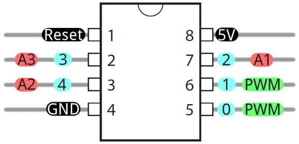

# ARDUINO - ATTINY - WIRELESS - IOT

Table of contents
=================

* [IoT with Arduino and RPi](#iot-with-arduino-and-rpi)
* [Wifi module ESP8266](#wifi-module-esp8266)
* [NRF24l01](#nrf24l01)
* [ATtiny85](#attiny85)

IoT with Arduino and RPi
----------------------------

### Raspberry (gateway) and Arduino (node sensor)

Ejemplo de arquitectua hardware:


[Fuente - parte 1](http://thenewstack.io/tutorial-prototyping-a-sensor-node-and-iot-gateway-with-arduino-and-raspberry-pi-part-1/)

[Fuente - parte 2](http://thenewstack.io/tutorial-configuring-a-sensor-node-and-iot-gateway-to-collect-and-visualize-data-part-2/)


Wifi module ESP8266
--------------------

Sirven para añadir WIFI al microcontrolador

- Se alimenta a 3.3v
- Alimentarlo con una fuente externa al Arduino, tiene picos de 200ma (al arrancar).
- Es un SoC: microcontrolador más wifi.


[Comparando Arduino y el ESP8266](http://polaridad.es/compara-arduino-esp8266/)


NRF24l01
-----------

[Tutorial](http://www.prometec.net/nrf2401/)

Dispositivos de radio basados en el chip de Nordic semiconductor  NRF24.

Estos modulos son TRANCEPTORES, es decir mediante programacion los podemos poner como emisores o como receptores o configurarlos para que hagan ambas cosas. Puede llegar a transmitir datos a 2Mbps , en distancias menores a 40 metros al aire libre y a 1Mbps a 8 metros de distancia.

- Operan en la banda de 2.4Ghz, que es de libre uso a nivel mundial (no tenemos garantía de que no haya alguien más emitiendo en esta banda en las cercanías, lo que puede producir interferencias)
- Velocidad configurable de 250kb, 1 Mb o 2Mb por segundo.
- Muy bajo consumo en Stand By (Cuando no se usan
- Podemos encontrar modelos con antenas más eficaces que aumentan el alcance hasta casi un km.
- Estos módulos usan el bus SPI.

[Arduino driver for nRF24L01](https://github.com/maniacbug/RF24)


| PIN   |  Arduino uno      |
|----------|:-------------:|
| MOSI | 11 |
| MISO | 12 |
| SCK | 13 |
| CS | 10 |
| CE | 9 |

### Soluciones a posibles problemas

- Es muy conveniente conectar un capacitor de 10NanoFaradios entre VCC y GND, para eliminar el ruido
Alimentacion a 3.3V o 5V.
- La manera más sencilla de evitar problemas ha sido asegurarme de que el emisor tiene una alimentación correcta y abundante, mediante un alimentador externo (al arduino).


ATtiny85
--------------

### Programar el ATtiny

Los microcontroladores AVR permiten la programación "in circuit". (ISP). No es necesario extraer el microcontrolador
de la placa de circuito impreso para reprogramarlo.




- binutils-avr --> herramientas como el ensamblador, enlazador, etc.
- gcc-avr --> compilador C GNU (compatible con ANSI C)
- avr-libc --> librería AVR C
- gdb-avr --> debugger
- avr-dude --> programador
- AVRStudio --> descarga gratis desde www.atmel.com (solo Windows)

```bash
$ apt-get install avrdude binutils-avr gcc-avr avr-libc gdb-avr

# Compilar 
$ avr-gcc -g -Os -mmcu=attiny88 -c hola_mundo_attiny85.c
$ avr-gcc -g -mmcu=attiny88 -o hola_mundo_attiny85.out hola_mundo_atttiny85.o

# Crear el hex. 
$ avr-objcopy -j .text -O ihex hola_mundo_atttiny85.out hola_mundo_attiny85.hex

# cargar el .hex en el attiny usando un programador.
```
Programa básico
```c
#include<avr/io.h>

int main(void)
{
        for(;;)
        {

        }
}

```
Programador ISP
```
+-----------+
|(6) (4) (2)|
|(5) (3) (1)|
+-----------+
     |_|
```

1. MISO
2. Vcc
3. SCK
4. MOSI
5. Reset
6. Ground


### Programar el ATtiny con arduino

[Programar el ATtiny con Arduino](http://aerobotclubderobticadeaeronuticos.blogspot.com.es/2011/06/micros-pequenos-para-proyectos-pequenos.html)

[Programming an ATtiny with arduino](http://highlowtech.org/?p=1229)

Utilizamos el arduino como programador ISP
- Descárgate y copia la carpeta (attiny45_85.zip) en la carpeta Hardware en la carpeta del Arduino. (...\arduino-0022\hardware\attiny45_85)
- Cierra el programa y vuelve abrirlo. Comprobaras que ahora en Tools/Board, te han aparecido muchas más opciones que antes.
- Monta el circuito de la figura:


- Conecta tu tarjeta de Arduino al ordenador: selecciónala en Board y el Puerto Serie que le corresponde.
- En la sección de “Ejemplos” de Arduino abre, compila y descarga a tu tarjeta el ejemplo de ArduinoISP (le estamos diciendo al Arduino que funcione como granador).
- Seleccionaremos en Tools/Board/ ATtinny85 (w/Arduino as ISP).
- Darle al botón de descargar programa.
- El ATTiny ya esta programado y listo para ser usado.

### Pinout ATtiny44_85

[Tutorial ATtiny 85](http://www.raspberrypi-es.com/category/attiny85/)


